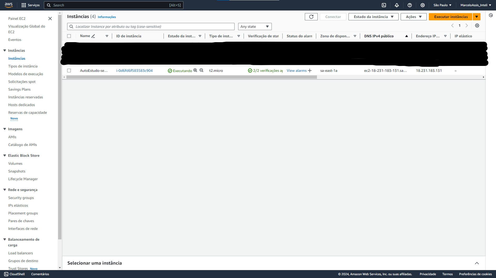
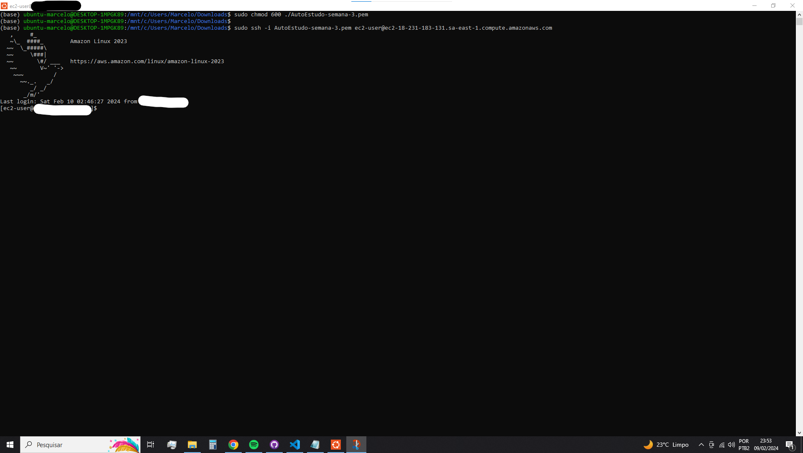

# Relatório Técnico: Criação e conexão em uma Instância EC2 na AWS

## Introdução 

Nesse relatório vamos criar uma Instância EC2 na AWS e após isso se conectar à ela usando um cliente SSH.

## Objetivo

O objetivo desse relatório técnico é mostrar uma instância EC2 gratuita do tipo t2.micro criada e mostrar ela conectada usando um client SSH

## Materiais

Os materiais utilizados para a criação e conexão via SSH em uma instância EC2 da amazon serão o console AWS para criação de uma instância EC2 gratuita do tipo t2.micro e um terminal Linux para fazer a conexão SSH na minha instância EC2 criada, para acessar um terminal linux no windows estou utilizando o WSL2 com o ubuntu instalado.

## Método

O Método para realizar o objetivo descrito no tópico "Objetivo" é criar um instância EC2 com um nome da sua escolha, selecionar alguma AMI que é qualificado para o nível gratuito, selecionar a instância do tipo t2.micro, criar um par de chaves para a conexão SSH posteriormente e deixar as configurações padrões no restante das configurações, visto que para esse objetivo não será nescessário modificar elas. como resultado será visto sua instância EC2 na sua página de instâncias EC2 no console AWS, dessa forma:

Após isso instale o WSL2 com alguma versão do linux de sua preferência.

Depois de instalar o WSL2 vá na aba da amazon de se conectar à ela e depois vá a aba "cliente SSH" e siga as instruções presentes nesse aba dentro do seu terminal linux, o resultado será algo parecido com isso:

